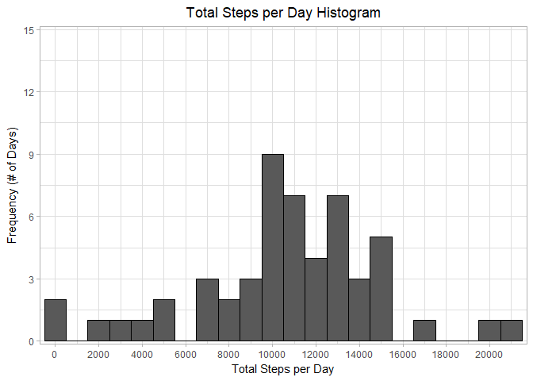
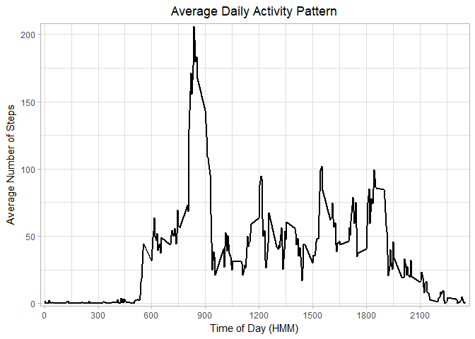
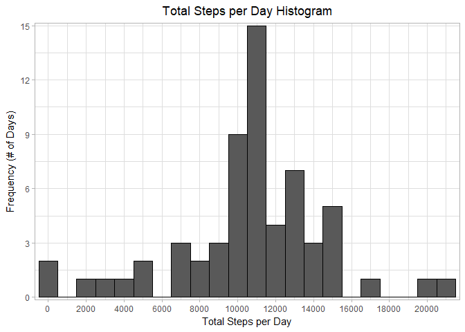
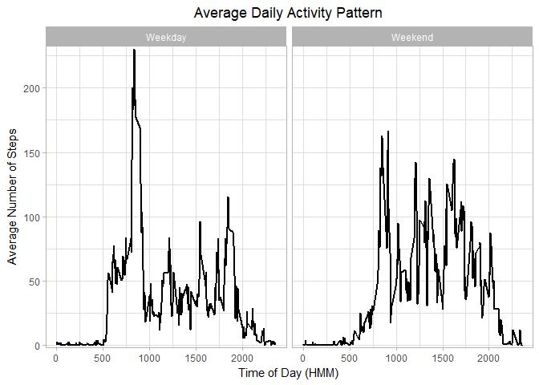

This file answers the questions for the reproducible research course project 1.  
All steps and code are shown.


## Loading and preprocessing the data

Initially the required libraries and data are loaded. 


```r
rm(list = ls())
library(dplyr)
```

```
## 
## Attaching package: 'dplyr'
```

```
## The following objects are masked from 'package:stats':
## 
##     filter, lag
```

```
## The following objects are masked from 'package:base':
## 
##     intersect, setdiff, setequal, union
```

```r
library(plyr)
```

```
## -------------------------------------------------------------------------
```

```
## You have loaded plyr after dplyr - this is likely to cause problems.
## If you need functions from both plyr and dplyr, please load plyr first, then dplyr:
## library(plyr); library(dplyr)
```

```
## -------------------------------------------------------------------------
```

```
## 
## Attaching package: 'plyr'
```

```
## The following objects are masked from 'package:dplyr':
## 
##     arrange, count, desc, failwith, id, mutate, rename, summarise,
##     summarize
```

```r
library(ggplot2)
wd <- 'C:\\Users\\Rob\\Documents\\Coursera\\RepData_PA1\\RepData_PeerAssessment1'
setwd(wd)

# Read in activity data
activity <- read.csv(paste0(wd,'\\activity.csv'), head = TRUE, sep=',',  na.strings = 'NA')

# Process the data
activity$date <- as.character(activity$date)
#Data with NAs removed
activity_na_rem <- activity[complete.cases(activity),] 
```

## What is mean total number of steps taken per day?

In order to calculate the mean total steps per day, the data is summarised for each day. This data is
then plotted onto a histogram. 


```r
# Data summarised per day
activity_per_day<- as.data.frame(ddply(activity_na_rem,'date',summarise,
                                         total_steps = sum(steps),
                                         avg_steps = mean(steps)))

# Histogram of toal number of steps per day
SPD_hist <- ggplot() +
        geom_histogram(data=activity_per_day, aes(total_steps), binwidth = 1000, col = "black")+
        ggtitle("Total Steps per Day Histogram" )+
        labs(x = "Total Steps per Day", y = "Frequency (# of Days)")+
        scale_x_continuous( breaks = seq(-2000,22000,2000), expand = c(0.01,0) )+
        scale_y_continuous(limits = c(0,15),breaks = seq(0,15,3), expand = c(0.01,0))+
        theme_light()+
        theme(plot.title = element_text(hjust = 0.5))
SPD_hist
```

<!-- -->

```r
# mean and median steps per day
mean_SPD <- round(mean(activity_per_day$total_steps),digits = 2)
median_SPD <- median(activity_per_day$total_steps)
```
The mean number of steps per day is 10766.19 steps and the median steps per day
is 10765 steps.  

## What is the average daily activity pattern?

In order to show the average daily activity pattern, first the data is summarised into 5-min intervals across the whole data period.  

A plot of the average daily activity pattern by 5min intervals is shown below.  


```r
# Data summarised per 5min period
activity_per_5min <- as.data.frame(ddply(activity_na_rem,'interval',summarise,
                                         total_steps = sum(steps),
                                         avg_steps = mean(steps)))


# plot of the average number of steps taken in each 5min interval
ADA_plot <- ggplot() +
        geom_line(data = activity_per_5min, aes(x = interval, y= avg_steps), size = 1.0 )+
        ggtitle("Average Daily Activity Pattern" )+
        labs(x = "Time of Day (HMM)", y = "Average Number of Steps")+
        scale_x_continuous( breaks = seq(-300,3000,300), expand = c(0.01,0) )+
        scale_y_continuous(expand = c(0.01,0)) +
       theme_light()+
       theme(plot.title = element_text(hjust = 0.5))
ADA_plot
```

<!-- -->

```r
# 5min period with max average number of steps
maxavgsteps <- max(activity_per_5min$avg_steps)
interval <- activity_per_5min[activity_per_5min$avg_steps == maxavgsteps,'interval']
```

The maximum average number of steps over the sample period occurs at 835, or 08:35am.  

## Imputing missing values


```r
# total number of missing values
total_missing_values <- nrow(activity)-nrow(activity_na_rem)
```
The total number of missing values contained within the data is 2304.  

The average number of steps in the 5 minute period of each missing value is used to impute the data. 

The histogram of the total steps per day including the imputted values is shown below.


```r
# strategy to impute missing data - replace with average for that 5min period
activity_imputted <- merge(activity,activity_per_5min, by='interval', all.x = TRUE)
activity_imputted <- activity_imputted[with(activity_imputted,order(date,interval)), ]
activity_imputted$finalsteps <- with(activity_imputted,ifelse(is.na(steps) == TRUE, 
                                        round(avg_steps, digits=0), steps))

# Histogram of total steps per day with imputted values included
activity_per_day_imputted <- as.data.frame(ddply(activity_imputted,'date',summarise,
                                                 total_steps = sum(finalsteps),
                                                 avg_steps = mean(finalsteps)))
# plot
SPD_hist_imputted <- ggplot() +
        geom_histogram(data=activity_per_day_imputted, aes(total_steps), binwidth = 1000, col = "black")+
        ggtitle("Total Steps per Day Histogram" )+
        labs(x = "Total Steps per Day", y = "Frequency (# of Days)")+
        scale_x_continuous( breaks = seq(-2000,22500,2000), expand = c(0.01,0) )+
        scale_y_continuous(limits = c(0,15),breaks = seq(0,15,3), expand = c(0.01,0))+
        theme_light()+
        theme(plot.title = element_text(hjust = 0.5))
SPD_hist_imputted
```

<!-- -->

```r
# mean and median of total number of steps per day
mean_SPD_imputted <- round(mean(activity_per_day_imputted$total_steps), digits = 2)
median_SPD_imputted <- median(activity_per_day_imputted$total_steps)
```

The mean and median values for the imputted data are 10765.64 steps and 10762 steps, respectively. 


## Are there differences in activity patterns between weekdays and weekends?

In order to compare the differences between weekdays and weekends, the day of the week for each date is found. This is then categorised into either weekdays or weekends. The plot below compares the difference in daily activity patterns between weekdays and weekends. 

```r
# create new dataframe containing weekdays and category and join on activity data
activity_imputted$weekday <- weekdays(as.Date(activity_imputted$date))
weekday <- c('Monday','Tuesday','Wednesday','Thursday','Friday','Saturday','Sunday')
weekday_cat <- c('Weekday','Weekday','Weekday','Weekday','Weekday','Weekend','Weekend')
week <- data.frame(cbind(weekday,weekday_cat))
activity_imputted <- merge(activity_imputted, week, by = 'weekday')

# new data per 5min period split by interval and weekday category
activity_per_5min_imputted <- as.data.frame(ddply(activity_imputted,c('interval','weekday_cat'),summarise,
                                                  total_steps = sum(finalsteps),
                                                  avg_steps = mean(finalsteps)))

# panel plot of average steps per day for weekdays and weekends
ADA_comparison <- ggplot() +
        geom_line(data = activity_per_5min_imputted, aes(x = interval, y= avg_steps), size = 1.0 )+
        facet_wrap(~weekday_cat)+
        ggtitle("Average Daily Activity Pattern" )+
        labs(x = "Time of Day (HMM)", y = "Average Number of Steps")+
        #scale_x_continuous( breaks = seq(-300,3000,300), expand = c(0.01,0) )+
        scale_y_continuous(expand = c(0.01,0)) +
        theme_light()+
        theme(plot.title = element_text(hjust = 0.5))
ADA_comparison
```

<!-- -->
